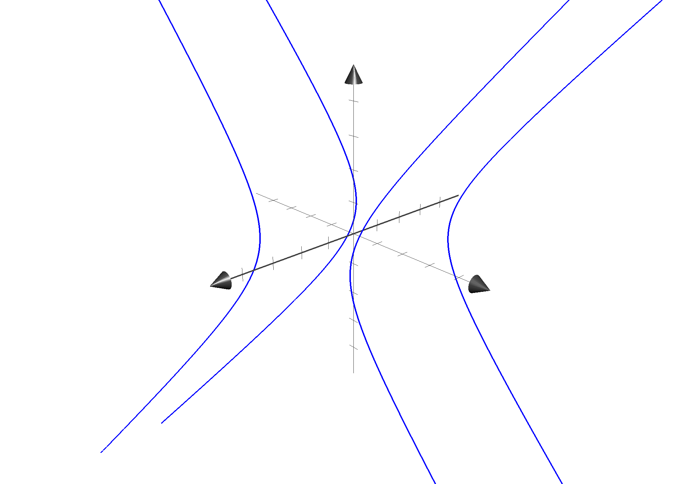
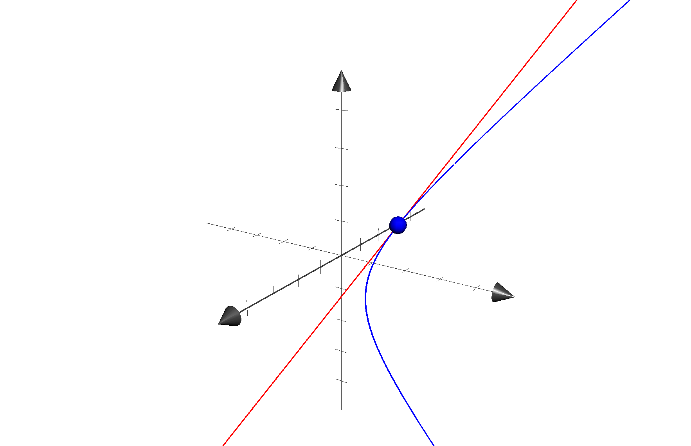

An exercise on submanifolds arising as regular level sets of smooth maps[^lee].

# An exercise on submersions
$\newcommand{R}{\mathbb{R}}$

Let $F: \R^3 \to \R^2$ be $F(x, y, z) = (x^2, y^2-z^2)$. Its differential is $dF_{(x,y,z)}: R^3 \to \R^2$ mapping $dF_{(x,y,z)}(a,b,c) = (2ax, 2by-2cz)$. The only critical point is $(x, y, z) = (0, 0, 0)$ with critical value $(0,0)$. Thus for all $(\alpha, \beta) \neq (0,0)$ the level set $S = {(x, y, z): F(x, y, z) = (\alpha, \beta)}$ if non-empty is a $1$-dimensional submanifold of $\R^3$ given in parametric form by

$$
\begin{split}
x^2 &= \alpha \\
y^2-z^2 &= \beta
\end{split}
$$

This is a disconnected manifold given by $4$ hyperbole branches.

For some fixed $\alpha > 0, \beta > 0$ the branch with $x > 0$ and $y > 0$ is parametrized by $\psi: \R \to \R^3$ with

$$\psi(t) = (x,y, z)(t) = (\sqrt{\alpha}, \sqrt{\beta + t^2}, t)$$

Differentiating the parametrization with respect to $t$ gives the vector field $\partial_t$ spanning the tangent space to $S$ at $t$ as a linear combination of the basis vector fields $\partial_x, \partial_y, \partial_z$: we get $\partial_t = (0, z, y)$, so the affine tangent space to $S$ at $(x, y, z)$ is 

$$
\tilde{T}_{(x,y,z)}S = T_{(x,y,z)}S + (x,y,z) = \langle(0, z, y)\rangle + (x, y, z).
$$

For example for $t = 1$, $\alpha = \beta = 1$, $(x, y, z) = (1, \sqrt{2}, 1)$, we get

$$
\tilde{T}_{(1,\sqrt{2},1)}S  = \langle(0, 1, \sqrt{2})\rangle + (1, \sqrt{2}, 1).
$$

[^lee]: J. M. Lee, _Introduction to Smooth Manifolds_, 2nd ed. in Graduate Texts in Mathematics. Springer-Verlag New York, 2012.