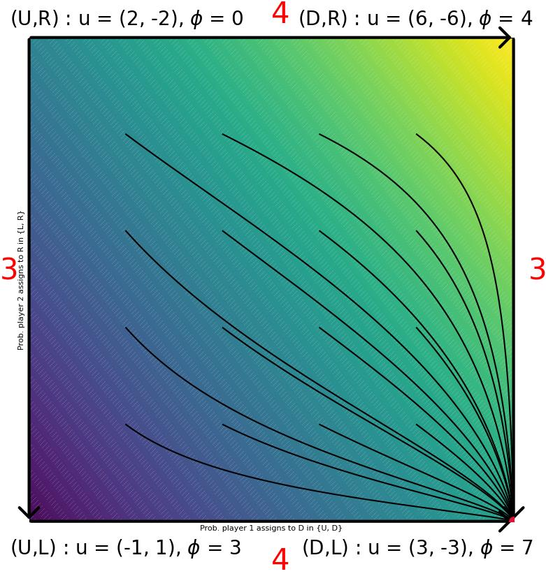

---
tags:
  - game-theory
  - learning-in-games
---

An example of a game which is at the same time zero-sum and potential.

# A potential zero-sum game

Consider the **zero-sum** $2\times 2$ game with payoff bimatrix given by

$$
u_1 = \begin{pmatrix}
-1,1 & 2,-2 \\
3,-3 & 6,-6.
\end{pmatrix}
$$

It's easy to check that the game is **potential** with potential function

$$
\phi = \begin{pmatrix}
3 & 0 \\
7 & 4
\end{pmatrix},
$$

and that $(\text{down}, \text{left})$ with outcome $(3, -3)$ is strict Nash. Since the game has non-trivial unilateral deviations it is not strategically equivalent to the zero-game, thus showing that the spaces of zero-sum and potential games intersect non-trivially, even after quotienting away strategical equivalence.

The image below shows the response graph of the game and some trajectories of replicator dynamics converging to the strict Nash equilibrium.

